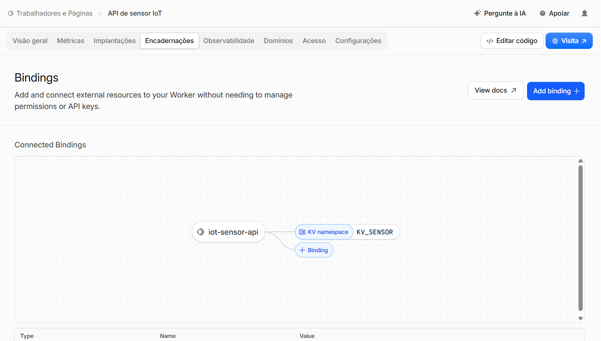
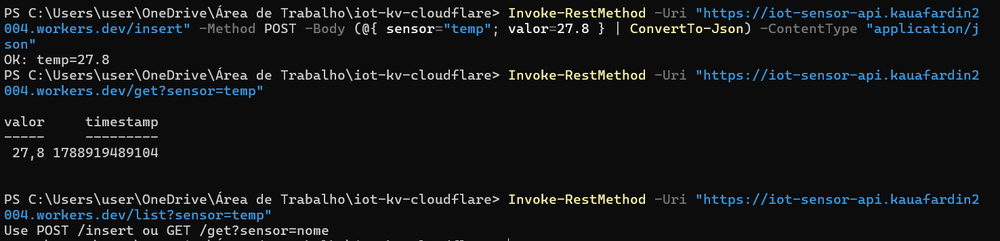
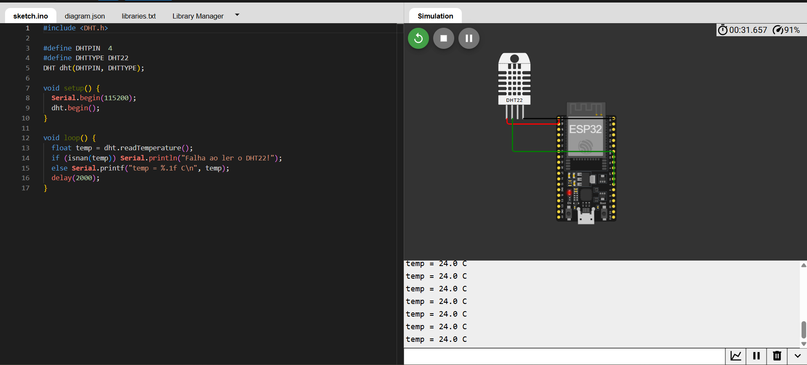
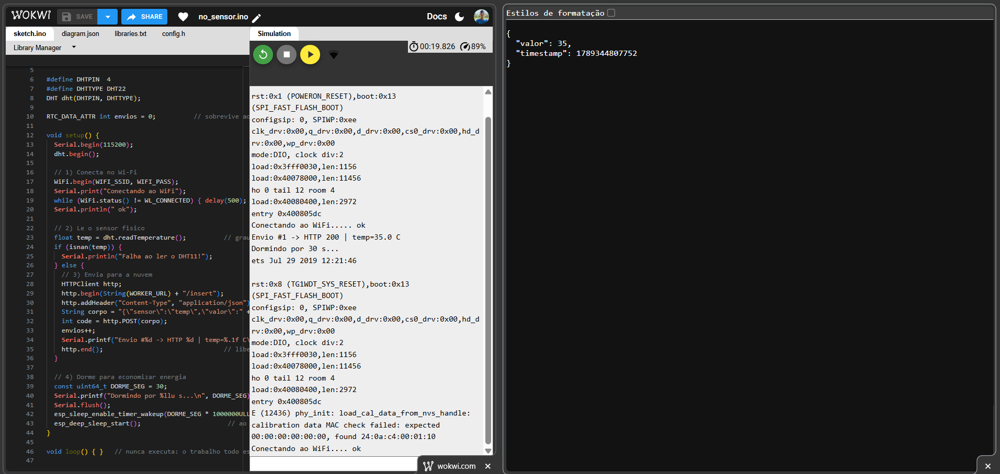
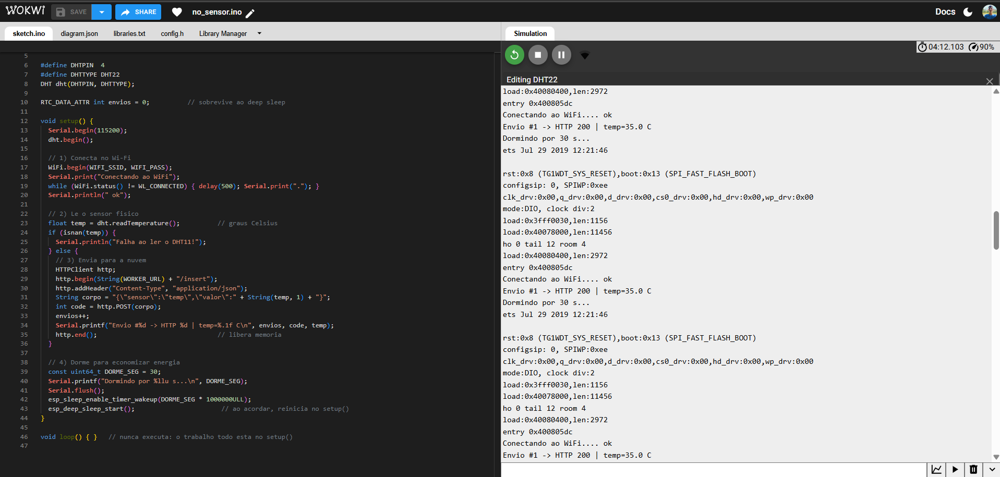
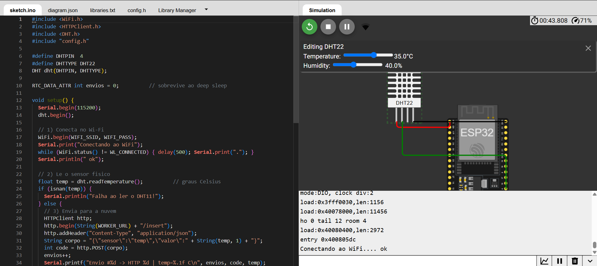
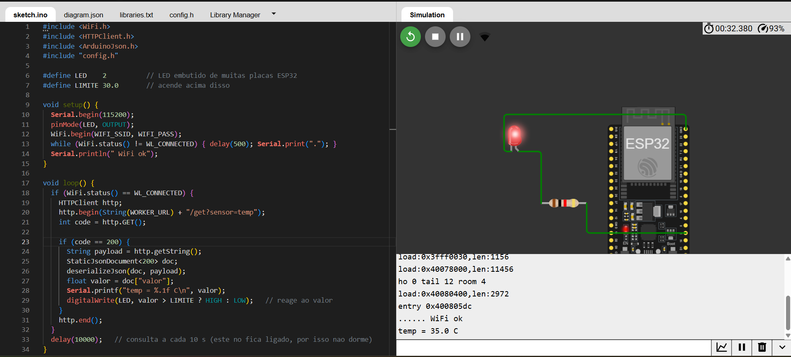
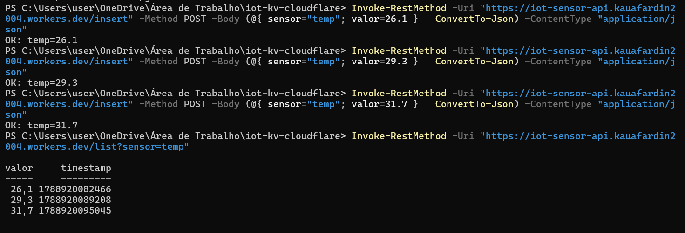
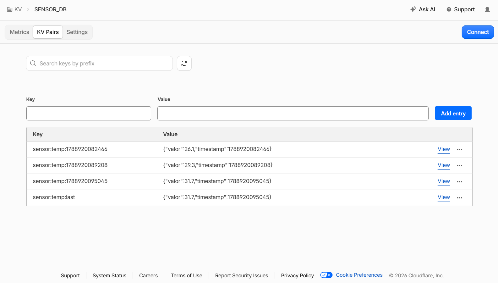

# ENTREGA — Atividade IoT: sensor físico na nuvem com KV + Cloudflare Workers

**Aluno:** Kauã Fardin
**Disciplina:** Internet das Coisas (IoT) — Turma AMF 2026-02
**URL do Worker:** https://iot-sensor-api.kauafardin2004.workers.dev

---

## Checklist das etapas

- [x] Etapa 0 — Conta criada no Cloudflare
- [x] Etapa 1 — Worker criado + namespace KV criado e ligado como `KV_SENSOR`
- [x] Etapa 2 — `/insert` e `/get` publicados
- [x] Etapa 3 — Testado pelo PowerShell (print abaixo)
- [x] Etapa 4 — Sensor DHT22 ligado e lendo no Serial Monitor
- [x] Etapa 5 — Nó sensor enviando a leitura real por `POST /insert`
- [x] Etapa 6 — Deep Sleep funcionando com `RTC_DATA_ATTR`
- [x] Etapa 7 — Nó atuador acendendo o LED acima do limite
- [x] Etapa 8 — Histórico e `/list` funcionando

---

## Prints

### Etapa 1 — Worker criado e KV associado

O binding `KV_SENSOR` aponta para o namespace `SENSOR_DB`. É esse nome de variável
que o código do Worker usa em `env.KV_SENSOR`.

### Etapa 3 — teste pelo PowerShell

Comandos da seção 6 do enunciado: `POST /insert` gravou `temp=27.8`, `GET /get` devolveu
o valor com o timestamp e `GET /list` ainda respondeu a mensagem de ajuda, porque o
Worker estava na versão 1 (o `/list` entra na etapa 8).

### Etapa 4 — leitura do sensor no Serial Monitor

Feita no simulador Wokwi, com o sensor DHT22 no lugar do DHT11 (o enunciado permite
o DHT22 ajustando o `DHTTYPE`). Ligação: VCC no 3V3, GND no GND e dados no GPIO 4.
O ESP32 lê a temperatura a cada 2 segundos e mostra no Serial Monitor, ainda sem nuvem.

### Etapa 5 — envio da leitura para a nuvem

No Wokwi, o ESP32 conecta na rede `Wokwi-GUEST`, lê o DHT22 e envia a temperatura com
`POST /insert`. O Worker respondeu HTTP 200 e o `GET /get` mostra o mesmo valor que saiu
no Serial Monitor.

### Etapa 6 — deep sleep

O ciclo do deep sleep funcionou: o ESP32 acorda, conecta no Wi-Fi, envia a leitura,
mostra `Dormindo por 30 s...` e dorme. Depois acorda e repete. O histórico do `/list`
recebeu uma leitura nova a cada ciclo.

O contador com `RTC_DATA_ATTR` não subiu: aparece sempre `Envio #1`. Isso é uma
limitação do simulador Wokwi. Ao acordar, ele reinicia a placa com
`rst:0x8 (TG1WDT_SYS_RESET)`, que é um reset comum e apaga a memória RTC. Num ESP32 de
verdade o despertar aparece como `rst:0x5 (DEEPSLEEP_RESET)`, a memória RTC é mantida
e o contador sobe (`Envio #1`, `#2`, `#3`...). O código é o do enunciado, sem alteração.

### Etapa 7 — nó atuador com o LED aceso

Em outro projeto no Wokwi, o nó atuador (ESP32 + LED com resistor de 220 Ω no GPIO 2)
consulta `GET /get?sensor=temp` a cada 10 segundos. No nó sensor, a temperatura do DHT22
foi colocada em 35 °C. Depois do envio, o atuador leu `temp = 35.0 C`, que passa do
limite de 30 °C, e acendeu o LED.

### Etapa 8 — histórico pelo /list

Depois de trocar o código do Worker pela versão 2 (seção 5.2 do enunciado), cada
`POST /insert` passa a gravar duas chaves: `sensor:temp:last` e
`sensor:temp:<timestamp>`. O `GET /list` devolve o histórico completo.

### Painel da Cloudflare — chaves no KV

O namespace `SENSOR_DB` com as quatro chaves gravadas: as três do histórico
(`sensor:temp:<timestamp>`) e a `sensor:temp:last`, que guarda sempre a leitura
mais recente.

---

## Perguntas

### 1. Com suas palavras, o que é o Cloudflare Workers e o que é o KV?

O Cloudflare Workers roda código na nuvem sem precisar de servidor. Eu escrevo uma
função em JavaScript, faço o deploy e ganho uma URL. Quando alguém acessa essa URL, a
função roda e responde.

O KV é o banco de dados. Ele guarda tudo em pares de chave e valor: cada leitura é
salva com uma chave (que é um texto) e depois é buscada por essa mesma chave. Não tem
tabela nem SQL. Eu usei três comandos: `put` para gravar, `get` para ler e `list` para
listar as chaves de um prefixo.

Os dois se completam. O Worker é a API, que recebe e responde. O KV é onde o dado fica
guardado. Sem o KV o dado se perderia, porque o Worker roda e termina a cada requisição.

### 2. Explique o caminho de um dado desde o sensor físico até ficar salvo no KV.

1. O DHT22 mede a temperatura e manda o valor para o ESP32 pelo GPIO 4. No código isso
   é o `dht.readTemperature()`.
2. O ESP32, já conectado no Wi-Fi, monta uma requisição HTTP: método POST, caminho
   `/insert` e o corpo `{"sensor":"temp","valor":27.8}`.
3. Essa requisição vai pelo roteador e chega na URL do meu Worker.
4. O Worker roda, vê que o caminho é `/insert`, lê o corpo com `request.json()` e separa
   o nome do sensor e o valor.
5. O Worker chama `env.KV_SENSOR.put()` e grava duas chaves: a `sensor:temp:last`, com a
   leitura mais nova, e a `sensor:temp:<timestamp>`, que vai formando o histórico.
6. O Worker responde `OK: temp=27.8`. O ESP32 lê essa resposta e vai dormir.

Na volta é o contrário: o nó atuador chama `GET /get?sensor=temp`, o Worker busca no KV
e devolve o JSON, e o ESP32 lê o valor e decide se acende o LED.

### 3. O que o Deep Sleep desliga no ESP32 e por que isso economiza energia? O que muda no consumo?

O Deep Sleep desliga a CPU, o Wi-Fi, o Bluetooth, quase toda a memória RAM e os
periféricos. Fica ligada só a parte RTC, que é um temporizador de consumo bem baixo e é
quem acorda a placa depois.

Isso economiza porque o que gasta energia no ESP32 é o Wi-Fi transmitindo e a CPU
rodando. Com o Wi-Fi ligado o consumo fica em torno de 80 a 160 mA. Dormindo, cai para
a casa dos microamperes.

Na prática, um sensor ligado direto acabaria com uma bateria em menos de um dia.
Acordando só alguns segundos a cada 30 s, a mesma bateria dura semanas. A troca é que
eu não tenho o dado o tempo todo, só a cada intervalo.

### 4. Por que a variável de contagem usa `RTC_DATA_ATTR`? O que aconteceria sem isso?

Porque o ESP32 não continua de onde parou quando acorda: ele reinicia e roda o `setup()`
de novo. Como a RAM normal foi desligada durante o sono, qualquer variável comum volta
ao valor inicial.

O `RTC_DATA_ATTR` guarda a variável na memória RTC, que continua ligada enquanto a placa
dorme. Por isso o contador sobrevive.

Sem isso, `envios` voltaria para zero toda vez e o Serial Monitor mostraria "Envio #1"
para sempre. Vale lembrar que o `= 0` só vale quando eu energizo a placa ou aperto o
reset. Ao acordar do deep sleep o valor é mantido.

### 5. Por que o nó sensor dorme, mas o nó atuador fica ligado?

Porque eles fazem coisas diferentes.

O nó sensor só precisa falar de vez em quando. Ele fica a bateria, longe da tomada, e a
temperatura não muda tanto de um minuto para o outro. Então ele acorda, mede, envia e
dorme.

O nó atuador precisa reagir na hora. Se ele dormisse, o LED ficaria aceso ou apagado
durante todo o sono, mesmo com a temperatura já tendo mudado. Além disso ele costuma
estar na tomada, porque quem aciona uma lâmpada ou um relé já precisa de energia.

Resumindo: quem manda o dado pode dormir, quem responde ao dado precisa estar acordado.
Como o KV guarda o último valor, o atuador consegue ler mesmo com o sensor dormindo.

### 6. Por que o ESP32 precisa conectar no Wi-Fi antes de enviar a leitura?

Porque o HTTP depende da rede. Sem conexão não existe caminho para a requisição sair.
Enquanto o ESP32 não conecta no roteador, ele não tem IP e não consegue nem descobrir o
endereço do `workers.dev`. O `http.POST()` falharia e devolveria um código negativo.

Por isso o código fica esperando no laço até `WiFi.status()` virar `WL_CONNECTED`. Só
depois disso é que ele abre a conexão com o Worker.

Outro detalhe: o ESP32 só enxerga rede de 2,4 GHz. Se o roteador estiver em 5 GHz, ele
nem acha a rede.

---

