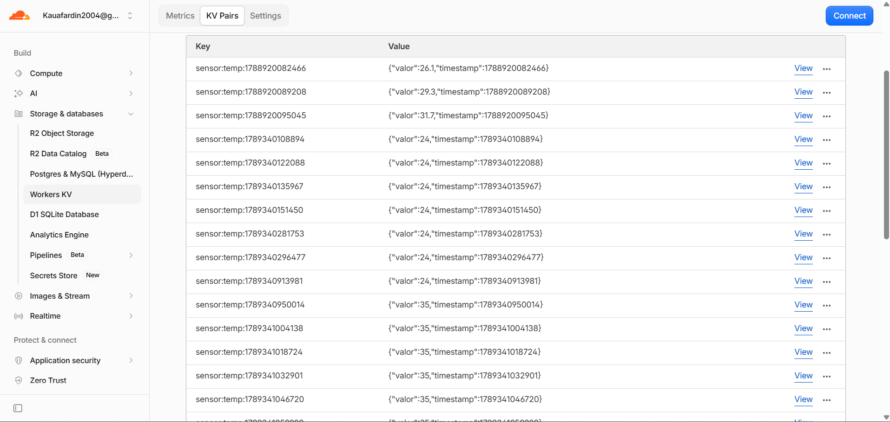

# ENTREGA — Atividade IoT: sensor físico na nuvem com KV + Cloudflare Workers

**Aluno:** Kauã Fardin
**Disciplina:** Internet das Coisas (IoT) — Turma AMF 2026-02
**URL do Worker:** https://iot-sensor-api.kauafardin2004.workers.dev

---

## Checklist das etapas

- [x] Etapa 0 — Conta criada no Cloudflare
- [x] Etapa 1 — Worker criado + namespace KV criado e ligado como `KV_SENSOR`
- [x] Etapa 2 — `/insert` e `/get` publicados
- [x] Etapa 3 — Testado pelo PowerShell (print abaixo)
- [x] Etapa 4 — Sensor DHT22 ligado e lendo no Serial Monitor
- [x] Etapa 5 — Nó sensor enviando a leitura real por `POST /insert`
- [x] Etapa 6 — Deep Sleep funcionando com `RTC_DATA_ATTR`
- [x] Etapa 7 — Nó atuador acendendo o LED acima do limite
- [x] Etapa 8 — Histórico e `/list` funcionando

---

## Prints

### Etapa 1 — Worker criado e KV associado

O binding `KV_SENSOR` aponta para o namespace `SENSOR_DB`. É esse nome de variável
que o código do Worker usa em `env.KV_SENSOR`.

### Etapa 3 — teste pelo PowerShell

Comandos da seção 6 do enunciado: `POST /insert` gravou `temp=27.8`, `GET /get` devolveu
o valor com o timestamp e `GET /list` ainda respondeu a mensagem de ajuda, porque o
Worker estava na versão 1 (o `/list` entra na etapa 8).

### Etapa 4 — leitura do sensor no Serial Monitor

Feita no simulador Wokwi, com o sensor DHT22 no lugar do DHT11 (o enunciado permite
o DHT22 ajustando o `DHTTYPE`). Ligação: VCC no 3V3, GND no GND e dados no GPIO 4.
O ESP32 lê a temperatura a cada 2 segundos e mostra no Serial Monitor, ainda sem nuvem.

### Etapa 5 — envio da leitura para a nuvem

No Wokwi, o ESP32 conecta na rede `Wokwi-GUEST`, lê o DHT22 e envia a temperatura com
`POST /insert`. O Worker respondeu HTTP 200 e o `GET /get` mostra o mesmo valor que saiu
no Serial Monitor.

### Etapa 6 — deep sleep

O ciclo do deep sleep funcionou: o ESP32 acorda, conecta no Wi-Fi, envia a leitura,
mostra `Dormindo por 30 s...` e dorme. Depois acorda e repete. O histórico do `/list`
recebeu uma leitura nova a cada ciclo.

O contador com `RTC_DATA_ATTR` não subiu: aparece sempre `Envio #1`. Isso é uma
limitação do simulador Wokwi. Ao acordar, ele reinicia a placa com
`rst:0x8 (TG1WDT_SYS_RESET)`, que é um reset comum e apaga a memória RTC. Num ESP32 de
verdade o despertar aparece como `rst:0x5 (DEEPSLEEP_RESET)`, a memória RTC é mantida
e o contador sobe (`Envio #1`, `#2`, `#3`...). O código é o do enunciado, sem alteração.

### Etapa 7 — nó atuador com o LED aceso

Em outro projeto no Wokwi, o nó atuador (ESP32 + LED com resistor de 220 Ω no GPIO 2)
consulta `GET /get?sensor=temp` a cada 10 segundos. No nó sensor, a temperatura do DHT22
foi colocada em 35 °C. Depois do envio, o atuador leu `temp = 35.0 C`, que passa do
limite de 30 °C, e acendeu o LED.

### Etapa 8 — histórico pelo /list

Depois de trocar o código do Worker pela versão 2 (seção 5.2 do enunciado), cada
`POST /insert` passa a gravar duas chaves: `sensor:temp:last` e
`sensor:temp:<timestamp>`. O `GET /list` devolve o histórico completo.

### Painel da Cloudflare — chaves no KV

O namespace `SENSOR_DB` com as quatro chaves gravadas: as três do histórico
(`sensor:temp:<timestamp>`) e a `sensor:temp:last`, que guarda sempre a leitura
mais recente.

Depois, com o nó sensor rodando, as leituras do ESP32 também foram gravadas no mesmo
namespace. Abaixo das três chaves do teste pelo PowerShell (26.1, 29.3 e 31.7) aparecem
as leituras enviadas pelo DHT22: primeiro 24 °C e depois 35 °C, quando a temperatura foi
alterada no simulador.

---

## Perguntas

### 1. Com suas palavras, o que é o Cloudflare Workers e o que é o KV?

O Workers é um lugar pra rodar código na nuvem sem ter que montar um servidor. Eu fiz o
código em JavaScript, dei deploy e ele virou uma URL. Toda vez que alguém chama essa URL,
o código roda e responde.

O KV é o banco de dados que eu usei. Ele é bem simples: guarda um valor ligado a uma
chave, e pra pegar o valor de volta é só usar a mesma chave. Não tem tabela nem SQL.

Então o Worker é quem recebe e responde as requisições, e o KV é onde os dados ficam
salvos.

### 2. Explique o caminho de um dado desde o sensor físico até ficar salvo no KV.

Primeiro o sensor mede a temperatura e o ESP32 lê esse valor. Com o Wi-Fi conectado, o
ESP32 manda um POST pro `/insert` do Worker com a temperatura em JSON.

O Worker recebe, pega o valor e salva no KV com o `put`. Ele grava em duas chaves: a
`sensor:temp:last`, que é sempre a última leitura, e uma com o timestamp, que vai
formando o histórico. No fim ele responde "OK" e o ESP32 vai dormir.

### 3. O que o Deep Sleep desliga no ESP32 e por que isso economiza energia? O que muda no consumo?

No Deep Sleep o ESP32 desliga quase tudo: o processador, o Wi-Fi e a maior parte da
memória. Só fica ligado um relógio interno que serve pra acordar a placa na hora certa.

Economiza porque o que mais gasta energia é justamente o Wi-Fi e o processador. Ligado
ele consome algo entre 80 e 160 mA, e dormindo cai pra poucos microamperes. Assim uma
bateria dura muito mais tempo.

### 4. Por que a variável de contagem usa `RTC_DATA_ATTR`? O que aconteceria sem isso?

Quando o ESP32 acorda do Deep Sleep ele reinicia e roda o `setup()` de novo, então as
variáveis normais voltam pro valor inicial. O `RTC_DATA_ATTR` guarda a variável numa
memória que continua ligada enquanto a placa dorme, e por isso o valor não se perde.

Sem ele o contador ia voltar pra zero toda vez e sempre ia aparecer "Envio #1".

### 5. Por que o nó sensor dorme, mas o nó atuador fica ligado?

O sensor só precisa mandar a temperatura de tempos em tempos, então ele pode acordar,
enviar e dormir de novo. Como normalmente ele fica na bateria, dormir faz a bateria
durar mais.

O atuador precisa estar sempre ligado pra reagir rápido quando a temperatura muda. Se
ele dormisse, o LED ia demorar pra acender ou apagar. E ele normalmente fica na tomada,
então não precisa economizar energia.

### 6. Por que o ESP32 precisa conectar no Wi-Fi antes de enviar a leitura?

Porque sem internet não tem como a requisição chegar no Worker. Enquanto não conecta, o
ESP32 não tem nem IP, então o envio ia dar erro. Por isso o código espera o Wi-Fi
conectar antes de mandar qualquer coisa.

---

